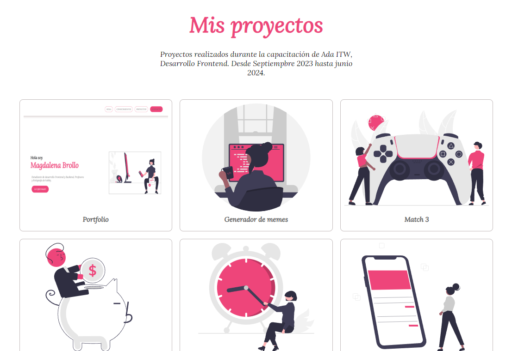

ADA Portafolio - TF Módulo1 [20va Desarrollo Frontend -Sept2023]

   
 

### **Proyecto: Portfolio Personal**

El presente proyecto contempla el desarrollo de un Portfolio Personal. Actividad realizada como Trabajo Final del primer módulo de HTML y CSS, de la capacitación de **"Desarrollo Frontend"** dictado por **ADA**.
En el presente portfolio personal incluiré el conjunto de trabajos a realizar a lo largo de mi trayectoria en esta capacitación.
 

###### Construcción:
EL portfolio fue desarrollado utilizando HTML y CSS. Se encuentra dividido en secciones que brindan información precisa sobre mis conocimientos, mis proyectos e información de contacto, con link vistosos que redirigen a los sitios de las diferentes redes sociales. Además, cuenta con un formulario donde el visitante puede completar con sus datos para luego ser contactado.

### Secciones

<ul>
   <li>Presentación</li>
   <li>Mis Conocimientos</li>
   <li>Mis Proyectos</li>
   <li>Contáctame</li>         
</ul>

##### Presentación:
Mis datos personales.

   
 

  

##### Mis Conocimientos:
Concoimientos adquiridos durante todo el trayecto de la capacitación.

   
 

##### Mis Proyectos:
Proyectos que iré desarrolando durante la capacitación Frontend de Ada.

   
 

##### Contactos:
Mis datos de contacto.

   
 

## **Contactos:**

